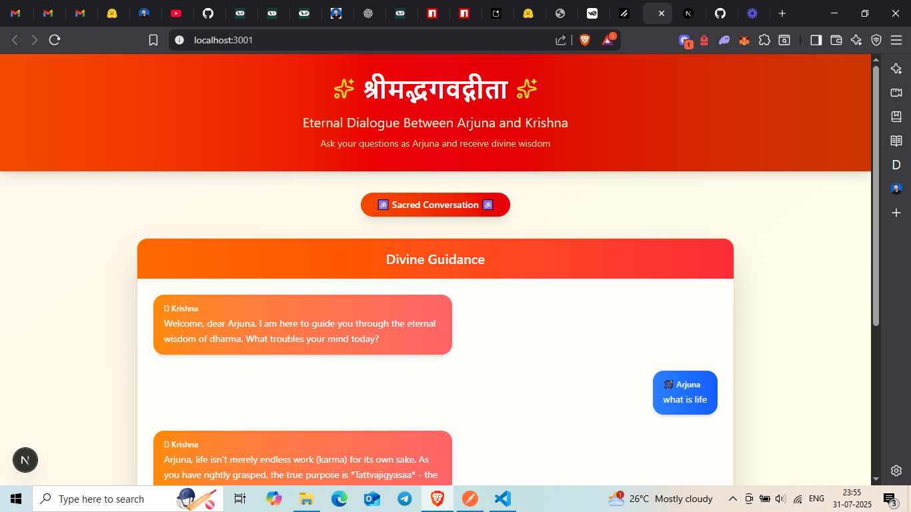

# 🕉️ Bhagavad Gita RAG Chatbot

> **Ask questions as Arjuna and receive divine wisdom from Krishna, powered by AI and grounded in sacred texts.**

A modern RAG (Retrieval-Augmented Generation) application that combines ancient wisdom with cutting-edge AI technology, allowing users to have meaningful conversations with Lord Krishna based on the teachings of the Bhagavad Gita.

## 🎥 Demo

[**🎬 Watch Live Demo**](https://www.loom.com/share/1e27a75ec5db4c4eb9a6f0a8990e25e3?sid=6b3c903b-0c59-4ee3-b984-b89c7d4a951c)



## ✨ Features

- 🤖 **AI-Powered Krishna**: Responds as Lord Krishna using Gemini 2.0 Flash LLM
- 📚 **RAG Architecture**: Retrieves relevant verses and context from Bhagavad Gita
- 🔍 **Semantic Search**: Uses FAISS vector store for intelligent text retrieval
- 🎨 **Beautiful UI**: Modern chat interface with gradient themes and spiritual aesthetics
- 🌐 **Hinglish Responses**: Natural conversation in Hindi-English mix
- ⚡ **Real-time Chat**: Instant responses with loading animations
- 📱 **Responsive Design**: Works seamlessly across all devices

## 🛠️ Tech Stack

### Backend
- **Node.js** + **Express.js** - RESTful API server
- **LangChain** - AI framework for LLM and embedding orchestration
- **Google Generative AI (Gemini 2.0 Flash)** - Large Language Model
- **HuggingFace Transformers** - Sentence embeddings
- **FAISS** - Vector database for semantic search
- **CORS** - Cross-origin resource sharing

### Frontend
- **Next.js 14** - React framework with App Router
- **TypeScript** - Type-safe development
- **Tailwind CSS** - Utility-first CSS framework
- **Lucide React** - Beautiful icons
- **Shadcn/ui** - Reusable UI components

### AI Pipeline
- **Text Splitting**: RecursiveCharacterTextSplitter for optimal chunking
- **Embeddings**: sentence-transformers/all-MiniLM-L6-v2
- **Vector Store**: FAISS for lightning-fast similarity search
- **LLM Integration**: Google Gemini 2.0 Flash for generation

## 🏗️ Architecture

```
┌─────────────────┐    ┌─────────────────┐    ┌─────────────────┐
│   Frontend      │    │   Backend       │    │   AI Pipeline   │
│   (Next.js)     │───▶│   (Express)     │───▶│   (LangChain)   │
│                 │    │                 │    │                 │
│ • Chat UI       │    │ • REST API      │    │ • Text Loader   │
│ • TypeScript    │    │ • CORS Setup    │    │ • Embeddings    │
│ • Tailwind      │    │ • Error Handle  │    │ • Vector Store  │
└─────────────────┘    └─────────────────┘    │ • Gemini LLM    │
                                              └─────────────────┘
```

## 🚀 Quick Start

### Prerequisites

- Node.js (v18 or higher)
- npm or yarn
- Google AI API Key
- HuggingFace API Key

### 1. Clone the Repository

```bash
git clone https://github.com/yourusername/bhagavad-gita-rag.git
cd bhagavad-gita-rag
```

### 2. Backend Setup

```bash
cd backend

# Install dependencies
npm install

# Create environment file
cp .env.example .env

# Add your API keys to .env
GOOGLE_GENAI_API_KEY=your_google_ai_api_key
HUGGINGFACEHUB_API_KEY=your_huggingface_api_key

# Start the backend server
npm start
```

The backend will start on `http://localhost:3000`

### 3. Frontend Setup

```bash
cd ../frontend

# Install dependencies
npm install

# Start the development server
npm run dev
```

The frontend will start on `http://localhost:3001`

### 4. Access the Application

Open your browser and navigate to `http://localhost:3001` to start chatting with Krishna!

## 📁 Project Structure

```
bhagavad-gita-rag/
├── backend/
│   ├── src/
│   │   ├── index.js          # Express server setup
│   │   ├── rag.js            # RAG pipeline implementation
│   │   └── gita_data.txt     # Bhagavad Gita text data
│   ├── vector_store/         # FAISS vector database
│   ├── package.json
│   └── .env
├── frontend/
│   ├── src/
│   │   ├── app/
│   │   │   ├── page.tsx      # Main chat page
│   │   │   ├── layout.tsx    # App layout
│   │   │   └── components/
│   │   │       └── landingpage.tsx  # Chat interface
│   │   ├── components/ui/    # Reusable UI components
│   │   └── lib/
│   ├── package.json
│   └── tailwind.config.js
└── README.md
```

## 🔧 Environment Variables

### Backend (.env)

```env
# Google AI API Key for Gemini LLM
GOOGLE_GENAI_API_KEY=your_google_ai_api_key

# HuggingFace API Key for embeddings
HUGGINGFACEHUB_API_KEY=your_huggingface_api_key

# Server Configuration (optional)
PORT=3000
```

## 📚 How It Works

### 1. **Document Processing**
- Bhagavad Gita text is loaded and split into semantic chunks
- Each chunk is converted to embeddings using HuggingFace transformers
- Embeddings are stored in FAISS vector database for fast retrieval

### 2. **Query Processing**
- User question is converted to embeddings
- Similar text chunks are retrieved using semantic search
- Top 3 most relevant passages are selected as context

### 3. **Response Generation**
- Context and question are sent to Gemini LLM
- Model responds as Lord Krishna in Hinglish
- Response is sent back to the frontend for display

### 4. **Chat Interface**
- Beautiful React chat UI with spiritual aesthetics
- Real-time conversation flow with loading states
- Responsive design for all devices

## 🎯 API Endpoints

### POST `/ask`

Ask a question to Krishna and receive wisdom from the Bhagavad Gita.

**Request Body:**
```json
{
  "question": "What is the meaning of life?"
}
```

**Response:**
```json
{
  "answer": "Arjuna, life ka matlab hai apne dharma ko follow karna..."
}
```

## 🎨 UI Features

- **Gradient Themes**: Beautiful orange-red gradients inspired by spiritual aesthetics
- **Chat Bubbles**: Distinct styling for Arjuna (blue) and Krishna (orange) messages
- **Loading Animation**: Elegant bouncing dots while Krishna is thinking
- **Sanskrit Quotes**: Inspirational verses from the Bhagavad Gita
- **Responsive Design**: Works perfectly on desktop, tablet, and mobile

## 🚀 Deployment

### Backend Deployment (Railway/Render)

1. Create account on Railway or Render
2. Connect your GitHub repository
3. Set environment variables in the platform
4. Deploy with automatic builds

### Frontend Deployment (Vercel)

1. Push your code to GitHub
2. Connect repository to Vercel
3. Update API endpoints to production URLs
4. Deploy with automatic builds

## 🔮 Future Enhancements

- [ ] **Multi-language Support**: Add support for pure Hindi and English
- [ ] **Voice Chat**: Audio input/output for immersive experience
- [ ] **More Sacred Texts**: Add Upanishads, Ramayana, and other scriptures
- [ ] **User Authentication**: Save conversation history
- [ ] **Advanced RAG**: Implement graph-based retrieval
- [ ] **Mobile App**: React Native version
- [ ] **Verse References**: Show exact Gita verses used in responses

## 🤝 Contributing

Contributions are welcome! Please feel free to submit a Pull Request.

1. Fork the repository
2. Create your feature branch (`git checkout -b feature/AmazingFeature`)
3. Commit your changes (`git commit -m 'Add some AmazingFeature'`)
4. Push to the branch (`git push origin feature/AmazingFeature`)
5. Open a Pull Request

## 📄 License

This project is licensed under the MIT License - see the [LICENSE](LICENSE) file for details.

## 🙏 Acknowledgments

- **Bhagavad Gita**: The eternal source of wisdom
- **LangChain**: For making AI application development accessible
- **Google**: For the powerful Gemini LLM
- **HuggingFace**: For excellent embedding models
- **Vercel**: For seamless Next.js deployment

## 📞 Contact

**Your Name** - [@yourtwitter](https://twitter.com/yourtwitter) - your.email@example.com

**Project Link**: [https://github.com/yourusername/bhagavad-gita-rag](https://github.com/yourusername/bhagavad-gita-rag)

**Live Demo**: [https://bhagavad-gita-rag.vercel.app](https://bhagavad-gita-rag.vercel.app)

---

*"यदा यदा हि धर्मस्य ग्लानिर्भवति भारत। अभ्युत्थानमधर्मस्य तदात्मानं सृजाम्यहम्॥"*

*"Whenever dharma declines and adharma rises, I manifest myself." - Krishna (4.7)*
